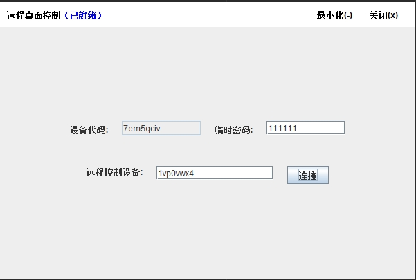
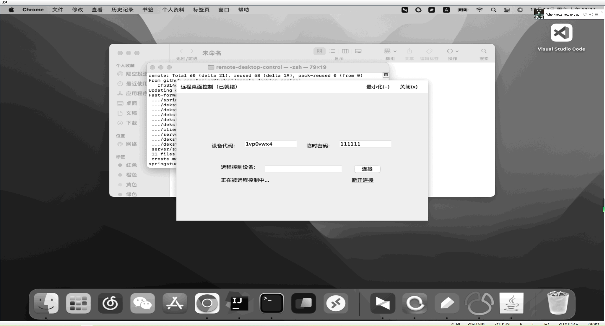
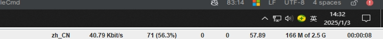
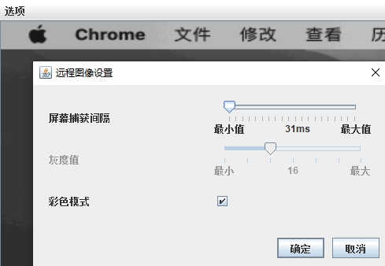
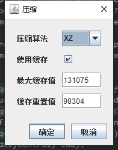
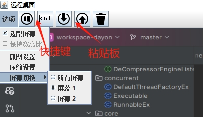

[English](README.md) | [中文](README_zh.md)

### 远程桌面应用程序

该项目是一个使用 **Java** 和 **Netty**
开发的远程桌面控制应用程序。通过该应用程序，用户可以实时连接并控制远程设备。是基于https://github.com/RetGal/Dayon
核心代码实现的client-server-client版本，在这里再次感谢Dayon作者的项目。

### 功能

1. **实时远程桌面控制**
    * 以最低的延迟远程控制另一台设备。

3. **可定制设置**
    * 配置屏幕捕获间隔，启用/禁用彩色模式以优化性能。

4. **跨平台支持**
    * 使用 Java 开发，可兼容大多数操作系统。

## 截图

### 主控制面板



### 远程连接已建立






### 设置菜单





### 运行环境

* Java 8 或更高版本
* 用于依赖管理的 Maven

### 构建与运行

1. 克隆代码库：
   ```bash
   git https://github.com/SpringStudent/remote-desktop-control
   cd remote-desktop-control
   ```

2. 构建项目：
   ```bash
   mvn clean install
   ```

3. 运行服务端：修改application.properties配置文件数据库信息和netty.server.server和port配置
   ```bash
   RemoteServer.java
   ```

4. 运行客户端：修改RemoteClient.java参数中的serverIp和serverPort和clipboardServer
   ```bash
   RemoteClient.java
   ```

### 未来规划

* 基于http的粘贴板传输 (已完成)


